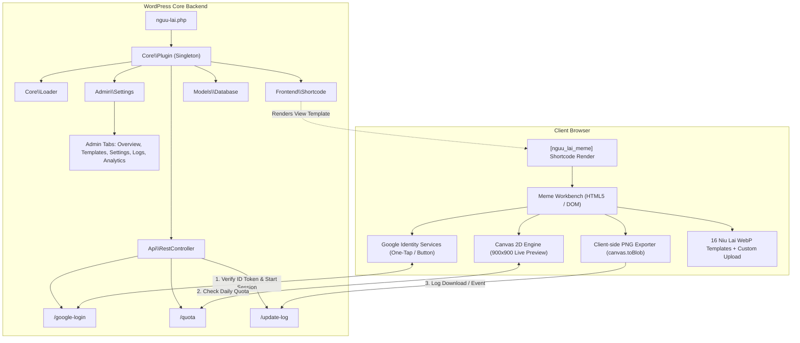
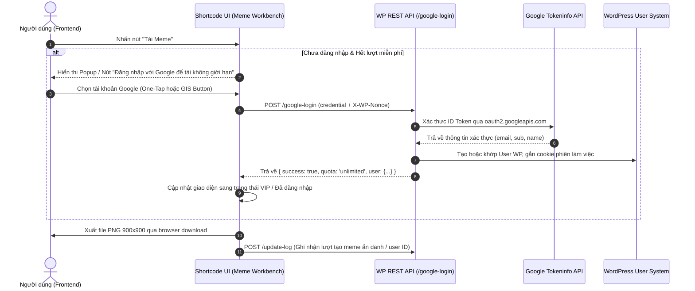

# Kiến trúc Hệ thống (ARCHITECTURE.md)

Tài liệu này mô tả chi tiết thiết kế kiến trúc, các luồng dữ liệu và mô hình tổ chức mã nguồn của plugin **Nguu Lai** (Meme Generator & Google Login Integration).

---

## 🏗️ 1. Mô hình Kiến trúc Tổng quan (Meme Shortcode & Hybrid Client Engine)

Plugin hoạt động theo mô hình **Client-Heavy Interactive Engine** kết hợp **WordPress Backend Security & Quota Manager**:



---

## 🎨 2. Kiến trúc Meme Workbench Canvas Engine

### 2.1. Tọa độ & Render Canvas (900 × 900)
- **Kích thước chuẩn:** 900px × 900px cố định (tối ưu chia sẻ mạng xã hội Facebook, Twitter, Telegram, Discord).
- **Scale tỷ lệ ảnh (Aspect Ratio Fit/Cover):**
  ```javascript
  const scale = Math.max(canvas.width / image.naturalWidth, canvas.height / image.naturalHeight);
  const width = image.naturalWidth * scale;
  const height = image.naturalHeight * scale;
  ctx.drawImage(image, (canvas.width - width) / 2, (canvas.height - height) / 2, width, height);
  ```
- **Tự động ngắt dòng thông minh (Smart Word Wrap):**
  Hỗ trợ cả ký tự CJK (không có dấu cách) và từ ngữ Latinh (ngắt theo khoảng trắng):
  ```javascript
  function wrapCanvasText(ctx, text, maxWidth) {
      const units = /\s/.test(text) ? text.split(/\s+/) : Array.from(text);
      const separator = /\s/.test(text) ? " " : "";
      const lines = [];
      let line = "";
      units.forEach((unit) => {
          const candidate = line ? `${line}${separator}${unit}` : unit;
          if (ctx.measureText(candidate).width > maxWidth && line) {
              lines.push(line);
              line = unit;
          } else {
              line = candidate;
          }
      });
      if (line) lines.push(line);
      return lines.slice(0, 3);
  }
  ```
- **Typo & Hiệu ứng Chữ:**
  - Font: `900 ${fontSize}px Arial, "PingFang SC", "Noto Sans CJK SC", sans-serif`.
  - Stroke viền đen (`#111`) độ dày `Math.max(6, fontSize * 0.13)` tạo độ tương phản cao trên mọi phôi ảnh.
  - Chữ màu trắng `#fff`, căn giữa (`textAlign = "center"`, `textBaseline = "middle"`).
- **Watermark Layer:**
  In mờ góc phải dưới (`niulai.wiki` hoặc text cấu hình trong Admin) nếu người dùng bật checkbox.

---

## 🔑 3. Luồng Đăng nhập Google & Quota Lifecycle



---

## 🗄️ 4. Cơ sở Dữ liệu & Lưu trữ (Models & Data Layer)

### 4.1. Bảng `wp_nguu_lai_logs` (Nhật ký tạo meme)
Ghi nhận các tác vụ để phục vụ thống kê trong Admin:
- `id` (BIGINT AUTO_INCREMENT PRIMARY KEY)
- `session_id` (VARCHAR(64))
- `user_id` (BIGINT UNSIGNED DEFAULT 0)
- `ip_address` (VARCHAR(45))
- `template_name` (VARCHAR(50) - ví dụ: `niulai_02.webp` hoặc `custom_upload`)
- `meme_text` (VARCHAR(255))
- `status` (VARCHAR(20) - 'completed', 'cancelled')
- `debug_context` (TEXT - JSON)
- `plugin_version` (VARCHAR(20))
- `created_at` (DATETIME)

### 4.2. Options API (`wp_options`)
- `nguu_lai_google_client_id`: Google OAuth Client ID.
- `nguu_lai_require_login`: Bắt buộc đăng nhập để tải (true/false).
- `nguu_lai_guest_download_limit`: Hạn mức tải miễn phí cho khách (ví dụ: 3 lượt/ngày).
- `nguu_lai_default_phrases`: Danh sách câu thoại hiển thị trong Phrase Library.
- `nguu_lai_watermark_text`: Chữ watermark mặc định.
- `nguu_lai_watermark_enabled`: Trạng thái bật/tắt mặc định của watermark.

---

## 🎛️ 5. Phân tầng Quản trị (Admin Service Provider)

Dashboard được tổ chức theo tab:
1. **Overview & Shortcode:** Hướng dẫn sử dụng shortcode `[nguu_lai_meme]`, mã nhúng, demo trực tiếp.
2. **Meme Templates & Phrases:** Quản lý danh sách câu thoại (thêm/sửa/xóa câu thoại mặc định).
3. **Google Auth & Quotas:** Cấu hình Google Client ID, hạn mức khách vãng lai, toggle bắt buộc đăng nhập.
4. **Logs & Analytics:** Danh sách nhật ký tải meme, bộ lọc ngày tháng, tỷ lệ template được yêu thích nhất.
5. **Security & Blocklist:** Quản lý IP bị chặn, tin cậy Proxy/Cloudflare.

---

## ⚡ 6. Tối ưu Hiệu năng & Quyền riêng tư

1. **Không Upload Ảnh lên Server:** Ảnh tùy chỉnh của người dùng được xử lý bằng `URL.createObjectURL(file)` và vẽ trực tiếp vào Canvas. Không tốn dung lượng hosting WordPress và bảo vệ 100% quyền riêng tư người dùng.
2. **Template WebP Siêu nhẹ:** 16 phôi ảnh gốc được lưu trữ dạng `.webp` với dung lượng chỉ ~10KB/ảnh, tải siêu nhanh ngay cả trên mạng 3G/4G di động.
3. **Lazy Asset Loading:** CSS và JS của Meme Workbench chỉ được enqueue trên những trang thực sự có chứa shortcode `[nguu_lai_meme]` (sử dụng `has_shortcode()`).
