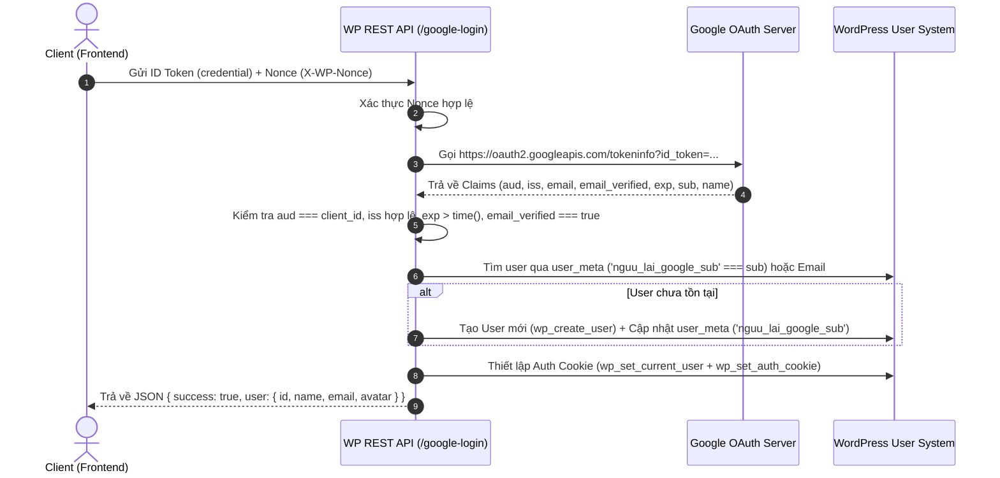
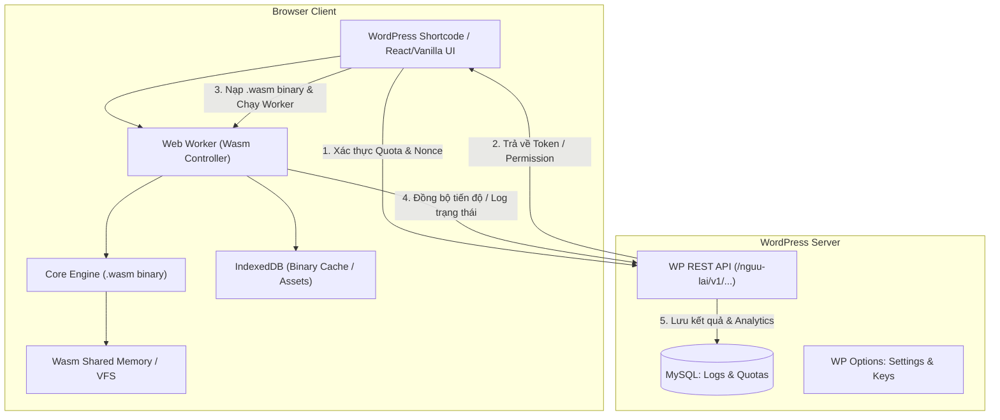

# Tiêu chuẩn Tái sử dụng từ Dự án VidBee Hybrid (STANDARDS-REUSE.md)

> **Tài liệu tham chiếu & kế thừa tiêu chuẩn:** Được trích xuất và tối ưu từ dự án tiền nhiệm [`vidbee-wordpress-hybrid`](https://github.com/hienhoceo-dpsmedia/vidbee-wordpress-hybrid/) phục vụ cho việc phát triển plugin **Nguu Lai** (Thuần WordPress + WebAssembly).

---

## 📑 Mục lục

1. [Mô hình Quản trị Admin Dashboard](#1-mô-hình-quản-trị-admin-dashboard)
2. [Cơ chế Xác thực & Quản lý User Login (Google OAuth + WP Session)](#2-cơ-chế-xác-thực--quản-lý-user-login-google-oauth--wp-session)
3. [Xử lý IP & Nhận diện Proxy / Cloudflare an toàn](#3-xử-lý-ip--nhận-diện-proxy--cloudflare-an-toàn)
4. [Bảo mật & Quyền riêng tư Dữ liệu (GDPR / Email Hashing)](#4-bảo-mật--quyền-riêng-tư-dữ-liệu-gdpr--email-hashing)
5. [Cấu trúc Cơ sở Dữ liệu & Hệ thống Logs / Analytics](#5-cấu-trúc-cơ-sở-dữ-liệu--hệ-thống-logs--analytics)
6. [Quản lý Giới hạn Lượt dùng & Chặn IP Tự động (Rate Limiting & Blocklist)](#6-quản-lý-giới-hạn-lượt-dùng--chặn-ip-tự-động-rate-limiting--blocklist)
7. [Kiến trúc Tích hợp WebAssembly (Wasm) trong WordPress](#7-kiến-trúc-tích-hợp-webassembly-wasm-trong-wordpress)

---

## 🖥️ 1. Mô hình Quản trị Admin Dashboard

Kế thừa cấu trúc giao diện quản trị phân tách theo Tabs rõ ràng, hỗ trợ lọc ngày linh hoạt và xử lý form qua `admin_post_*`:

### 1.1. Cấu trúc Tabs chuẩn
- **Logs (Nhật ký):** Hiển thị chi tiết từng tác vụ, phân trang, lọc theo phiên bản plugin (`log_version`), lọc theo khoảng thời gian (`preset`: Today, Yesterday, 7d, 14d, 30d, 90d, hoặc Custom Date Range).
- **Analytics (Thống kê):** Tổng hợp tỉ lệ thành công/thất bại, phân loại theo nền tảng/loại tác vụ, đếm số lượng người dùng duy nhất (Unique Users qua Hashed Email).
- **Blocklist (Danh sách chặn):** Quản lý IP bị chặn (thủ công hoặc tự động khi vi phạm Rate Limit), có thời hạn hết hạn (Expiration Timestamp).
- **Settings (Cài đặt):** Cấu hình toàn bộ Options của plugin, Google Client ID, Rate Limits, Proxy trust, Blocked Keywords, Custom CSS.
- **Export / Maintenance:** Xuất logs ra CSV/JSON, chức năng dọn dẹp log cũ chỉ giữ lại log của version mới nhất (`admin_keep_latest_logs`).

### 1.2. Chuẩn xử lý Form qua `admin-post.php`
- Đăng ký các hook `admin_post_nguu_lai_*` thay vì xử lý POST trực tiếp trong view render.
- Kiểm tra Nonce: `check_admin_referer( 'action_name', 'nonce_name' )`.
- Kiểm tra quyền: `current_user_can( 'manage_options' )`.
- Thực hiện logic -> Lưu `set_transient()` nếu cần thông báo -> Chuyển hướng an toàn bằng `wp_safe_redirect( add_query_arg( [ 'status' => 'success' ], $redirect_url ) )`.

---

## 🔑 2. Cơ chế Xác thực & Quản lý User Login (Google OAuth + WP Session)

Cơ chế đăng nhập 1 chạm / Google Sign-In kết hợp tạo phiên làm việc WordPress an toàn:

### 2.1. Quy trình Xác thực Google ID Token phía Backend
Endpoint: `POST /wp-json/nguu-lai/v1/google-login`



### 2.2. Quy tắc bảo mật xác thực Google Token:
1. **Audience Check:** Bắt buộc `claims.aud === get_option('nguu_lai_google_client_id')`.
2. **Issuer Check:** Bắt buộc `claims.iss` nằm trong `['https://accounts.google.com', 'accounts.google.com']`.
3. **Email Verification:** Bắt buộc `claims.email_verified === true`.
4. **Expiration:** Bắt buộc `claims.exp > time()`.
5. **Session Persistence:** Sử dụng `wp_set_current_user( $user->ID )` và `wp_set_auth_cookie( $user->ID, true )`.

---

## 🌐 3. Xử lý IP & Nhận diện Proxy / Cloudflare an toàn

Để chống giả mạo IP (IP Spoofing) khi trang web đặt sau Cloudflare hoặc Reverse Proxy:

```php
public static function get_client_ip(): string {
    $trust_proxies = (bool) get_option( 'nguu_lai_trust_proxies', false );
    $trusted_list  = get_option( 'nguu_lai_trusted_proxies', '' ); // CIDRs hoặc danh sách IP
    
    // Nếu tin cậy Cloudflare / Proxy được cấu hình
    if ( $trust_proxies && ! empty( $_SERVER['HTTP_CF_CONNECTING_IP'] ) ) {
        $ip = sanitize_text_field( wp_unslash( $_SERVER['HTTP_CF_CONNECTING_IP'] ) );
        if ( filter_var( $ip, FILTER_VALIDATE_IP ) ) {
            return $ip;
        }
    }
    
    if ( $trust_proxies && ! empty( $_SERVER['HTTP_X_FORWARDED_FOR'] ) ) {
        $forwarded = explode( ',', sanitize_text_field( wp_unslash( $_SERVER['HTTP_X_FORWARDED_FOR'] ) ) );
        $ip = trim( $forwarded[0] );
        if ( filter_var( $ip, FILTER_VALIDATE_IP ) ) {
            return $ip;
        }
    }
    
    return sanitize_text_field( wp_unslash( $_SERVER['REMOTE_ADDR'] ?? '127.0.0.1' ) );
}
```

---

## 🔒 4. Bảo mật & Quyền riêng tư Dữ liệu (GDPR / Email Hashing)

Khi ghi nhận logs thống kê (Analytics), để đảm bảo tuân thủ quyền riêng tư GDPR mà vẫn theo dõi được số lượng **Người dùng duy nhất (Unique Users)**:

```php
public static function hash_email( string $email ): string {
    $email = strtolower( trim( sanitize_email( $email ) ) );
    if ( '' === $email || 'guest' === $email ) {
        return '';
    }
    
    // Sử dụng secret salt của WordPress để chống Rainbow Table
    $secret = function_exists( 'wp_salt' ) ? wp_salt( 'auth' ) : AUTH_KEY;
    return hash_hmac( 'sha256', $email, $secret );
}
```

---

## 🗄️ 5. Cấu trúc Cơ sở Dữ liệu & Hệ thống Logs / Analytics

Tách biệt **Bảng nhật ký chi tiết (Raw Logs)** và **Bảng thống kê tổng hợp (Aggregated Analytics)** để đảm bảo truy vấn tốc độ cao:

### 5.1. Bảng `wp_nguu_lai_logs` (Nhật ký thô)
- `id` (BIGINT AUTO_INCREMENT PRIMARY KEY)
- `session_id` (VARCHAR(64) - UUIDv4)
- `user_id` (BIGINT UNSIGNED)
- `ip_address` (VARCHAR(45))
- `task_type` / `platform` (VARCHAR(50))
- `status` (VARCHAR(20) - 'initiated', 'processing', 'completed', 'failed', 'cancelled')
- `input_payload` (TEXT - sanitized)
- `debug_context` (LONGTEXT - JSON lưu metrics, thời gian thực thi, lỗi)
- `plugin_version` (VARCHAR(20))
- `created_at`, `updated_at` (DATETIME)
- **Indexes:** `KEY user_id (user_id)`, `KEY status (status)`, `KEY ip_address (ip_address)`, `KEY plugin_version (plugin_version)`.

### 5.2. Chuẩn hóa JSON Context Payload
Trước khi lưu trữ mảng context vào database, chuẩn hóa độ sâu tối đa 3 cấp và giới hạn độ dài string để tránh phình dung lượng database.

---

## ⏱️ 6. Quản lý Giới hạn Lượt dùng & Chặn IP Tự động

### 6.1. Phân cấp hạn mức (Quota Matrix)
| Nhóm người dùng | Giới hạn mặc định | Cơ chế kiểm tra |
| :--- | :--- | :--- |
| **Khách vãng lai (Guest)** | 3 - 5 tác vụ / ngày | Theo dõi qua `IP Address` + `Transients` (TTL 24h) |
| **Thành viên đăng nhập (Free User)** | 20 - 50 tác vụ / ngày | Theo dõi qua `User ID` + `wp_usermeta` / DB log |
| **Quản trị viên / VIP (Admin / Premium)** | Không giới hạn | Bỏ qua kiểm tra hạn mức (`unlimited`) |

### 6.2. Cơ chế tự động chặn IP (Auto Blocklist)
- Khi phát hiện một IP gửi vượt quá `N` requests bất thường trong khoảng thời gian `T` giây (Burst limit) hoặc quét payload độc hại -> Tự động ghi vào `nguu_lai_blocked_ips` với thời gian hết hạn (`expires_at = time() + 86400`).

---

## ⚡ 7. Kiến trúc Tích hợp WebAssembly (Wasm) trong WordPress

Vì plugin định hướng **Thuần WordPress + WebAssembly**, luồng hoạt động được thiết kế như sau:



### 7.1. Nguyên tắc triển khai WebAssembly trong WordPress:
1. **Nạp Asset an toàn:** Tệp nhị phân `.wasm` được phục vụ với MIME type chuẩn `application/wasm` thông qua header WordPress.
2. **Xử lý bất đồng bộ (Non-blocking):** Mọi tác vụ WebAssembly nặng bắt buộc chạy trong **Web Worker** để không làm đơ giao diện trình duyệt (UI thread).
3. **Bộ nhớ & IndexedDB Cache:** Khởi tạo WebAssembly Module và lưu cache vào IndexedDB của trình duyệt để người dùng không phải tải lại file `.wasm` ở các lần truy cập tiếp theo.
4. **Báo cáo trạng thái về Server:** Client gửi tín hiệu tiến độ (`progress`, `completed`, `failed`) kèm `execution_time_ms` về REST API `/update-log` để quản trị viên theo dõi hiệu suất Wasm.
